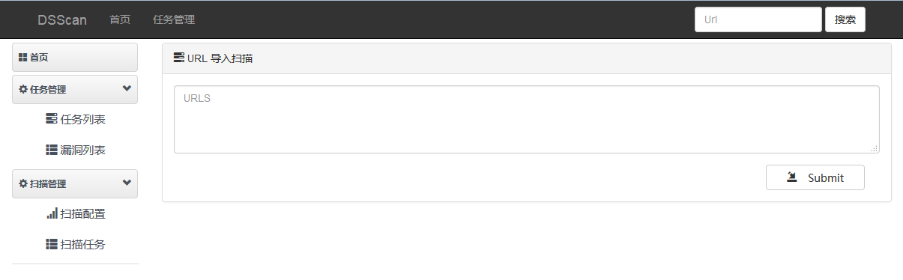

# DjangoProject-DSScan

### Environment
```
1. Python 2.7.11
2. Django 1.9.6
```

### Instruction
```
1. 利用Django结合SqlmapApi达到可视化批量检测
2. 前端采用了Bootstrap进行美化界面
3. 利用多线程方式进行扫描，前端可自定义线程数
4. 前端可以自定义扫描任务，以及删除任务
```

### Example



